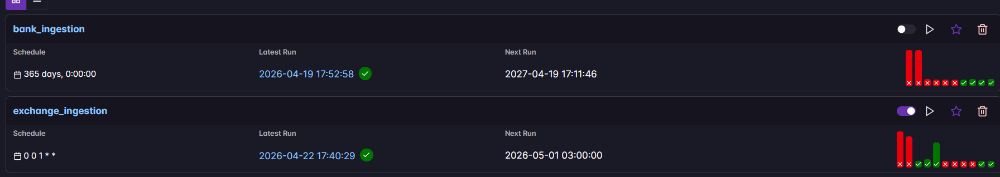
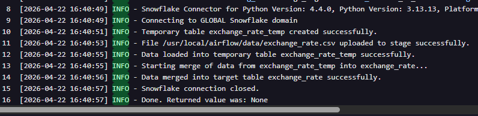
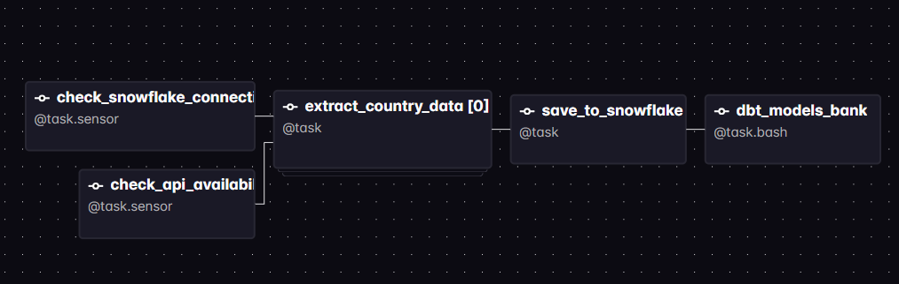
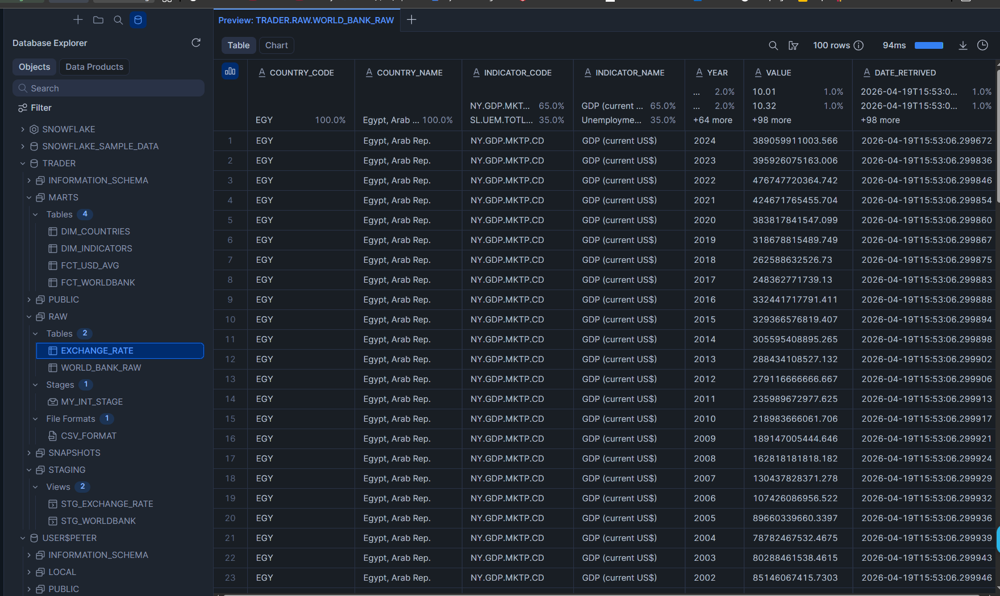
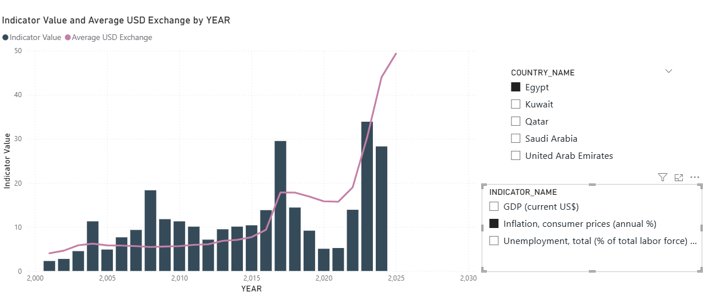

# Trader Data Engineering Platform

First, the idea comes from i want to build a platform that show me the relation between macroeconomic indicators and exchange rates, and how they affect the performance of a trading strategy.
I want to be able to ingest data from different sources, such as the World Bank and Open Exchange Rates, and load them into a data warehouse like Snowflake. Then, I want to use dbt to transform the data and create analytics-ready marts that can be consumed by BI tools like Power BI.

- so the project is a Production-style data pipeline project for ingesting macroeconomic indicators and FX rates, loading them into Snowflake, transforming them with dbt, and preparing analytics-ready marts for BI reporting.

Where i focused on implementing best practices for orchestration, idempotent loading, data quality testing, and iterative hardening based on audit feedback.

## 1) Project Idea

This project solves a common analytics challenge:

- External data sources are inconsistent and arrive at different cadences.
- Teams need reliable monthly FX data and periodic World Bank indicators.
- Raw API payloads are not directly consumable by BI tools.

The platform orchestrates ingestion with Airflow, applies warehouse-first transformations with dbt, and produces curated models for reporting.

## 2) Business Benefit

- Centralized and repeatable ingestion for exchange-rate and World Bank data.
- Faster analytics delivery through pre-modeled facts and dimensions.
- Better trust in numbers through automated dbt data-quality tests.
- Lower operational risk through retry logic, sensor rescheduling, and idempotent merge loading.

## 3) High-Level Architecture

- Source APIs:
  - Open Exchange Rates API (monthly historical FX)
  - World Bank Indicators API
- Orchestration:
  - Airflow DAGs in dags
- Storage and compute:
  - Snowflake RAW, STAGING, MARTS
- Transformation and quality:
  - dbt models and tests in dbt/trader_dbt
- Consumption:
  - Power BI report in Reports/report1.pbix

## 4) End-to-End Stages and How I Implemented Them

### Stage A: Ingestion orchestration (Airflow)

- Exchange pipeline DAG: dags/exchange_ingestion.py
  - Monthly schedule with retries and retry delay.
  - API availability sensor uses reschedule mode to avoid worker slot blocking.
  - Extraction is execution-date aware (year/month from run date).
- World Bank pipeline DAG: dags/bank_ingestion.py
  - Dynamic task mapping by country for indicator extraction.
  - Downstream load into Snowflake RAW table.

### Stage B: RAW loading in Snowflake

- Exchange pipeline uses staged file loading and merge-upsert strategy:
  - Create temp table like target.
  - PUT and COPY into temp table.
  - MERGE temp into target on business key (country_currency_code + date).
  - Cleanup temp table and stage file.
- This implementation supports idempotent reruns and safer operational behavior.

### Stage C: Transformation layer (dbt)

- Staging models normalize raw schema and parse date parts.
- Marts models provide analytics outputs:
  - fct_usd_avg: average yearly USD exchange rate by country.
  - fct_worldbank: country-indicator-year fact table.
  - dim_countries and dim_indicators dimensions.

### Stage D: Data quality and validation

- dbt generic and expectation tests validate:
  - accepted values for country/currency fields,
  - non-null constraints,
  - numeric bounds,
  - date format compliance.
- Current run status (latest): 16 PASS, 0 WARN, 0 ERROR.

### Stage E: BI consumption

- Curated MARTS models are consumed in Power BI.
- Report artifact exists in Reports/report1.pbix.

## 5) Repository Structure

- dags: Airflow orchestration.
- include: shared utilities/constants and engineering notes.
- dbt/trader_dbt: dbt project (models, macros, tests, packages).
- data: local data artifacts.
- Reports: BI output.
- tests: project tests.
- upcoming_fixes: tracked checklist items and hardening notes.

## 6) Audit Improvements I Implemented (Fixed by Me)

The following improvements were introduced after a production-readiness audit:

- Added retry policy for exchange DAG tasks.
- Switched API sensor to reschedule mode for better worker utilization.
- Replaced hardcoded extraction horizon with execution-date-driven logic.
- Corrected exchange payload schema alignment for dbt staging compatibility.
- Implemented idempotent Snowflake load using temp table + MERGE.
- Added output directory configurability through OUTPUT_DATA_PATH with safe fallback.
- Improved connector safety by initializing connection handle before cleanup logic.
- Fixed date format macro/test behavior so the full dbt test suite passes.

## 7) How to Run

### Prerequisites

- Docker + Astro CLI
- Python environment with dbt-snowflake
- Snowflake account and role with required access

### Required environment variables

- snowflake_account
- snowflake_database
- snowflake_user
- snowflake_password
- snowflake_warehouse
- snowflake_role
- open_exchange_api_key
- Optional: OUTPUT_DATA_PATH

### Typical local workflow

1. Start Airflow runtime via Astro.
2. Trigger DAG runs for exchange_ingestion and bank_ingestion.
3. Run dbt models and tests from dbt/trader_dbt.
4. Validate MARTS outputs and refresh BI report.

## 8) Screenshots

### Airflow DAGs Overview

### Exchange DAG Run

### Bank DAG Graph

### Snowflake View

### Power BI Dashboard

## 9) What I Learned and Notes

This section consolidates my notes from include/README.md.

- CSV handling with pandas:
  - Values containing commas are enclosed in double quotes to preserve field integrity.
  - Snowflake CSV file format should include FIELD_OPTIONALLY_ENCLOSED_BY='"' when needed.
- XCom serialization:
  - Pandas/native datetime values should be converted to ISO string form for safe JSON/XCom transport.
- Dynamic task mapping:
  - Airflow .expand requires JSON-serializable outputs.
  - Mapping enables concurrent execution, but max_active_tasks should be tuned to avoid resource contention.
- Sensor efficiency:
  - mode='reschedule' prevents long waits from monopolizing worker slots and improves scheduler throughput.

## 10) Current Limitations and Next Hardening Steps

- Move secrets fully out of tracked local files and rotate exposed credentials.
- Add CI pipeline for DAG import checks, dbt parse/build/test, and linting.
- Add stronger observability and alerting for task failures and freshness SLAs.
- Consider backfill strategy and policy for missed schedules.
- Extend automated tests under tests for orchestration and data contract coverage.

## 11) Portfolio Summary

This project demonstrates practical data engineering capabilities across orchestration, warehouse loading, transformation modeling, quality enforcement, and BI enablement, with clear evidence of iterative hardening based on audit feedback.
